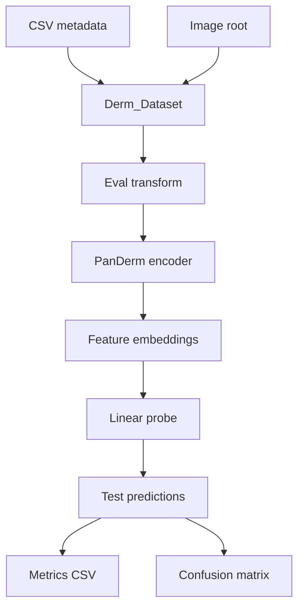
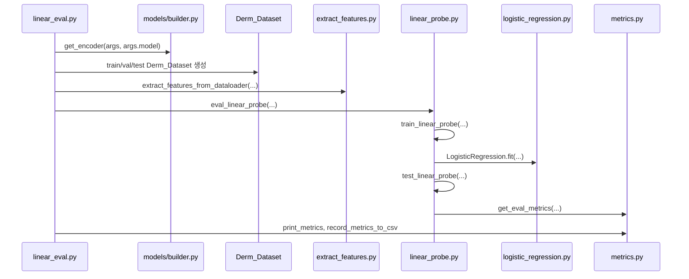

# PanDerm Linear Evaluation 동작 원리

**사전학습된 representation이 얼마나 분류에 유용한지 보는 평가**

PanDerm 사전학습 encoder는 고정한 채 이미지를 feature embedding으로 변환하고,
그 feature 위에 얕은 선형 분류기만 학습해서 downstream image classification 성능을 측정합니다.

```text
image -> frozen PanDerm encoder -> 1024-d feature -> linear classifier -> class probability
```

## 전체 흐름



실제 실행은 `classification/linear_eval.py`에서 시작

## 코드 관점 전체 호출 흐름

<details>
<summary>세부정보</summary>



| 단계 | 코드 위치 | 핵심 역할 | 입력 | 출력 | 읽을 때 주의점 |
|---:|---|---|---|---|---|
| 1 | [`linear_eval.py::get_args_parser`](../classification/linear_eval.py#L10) | CLI 인자를 정의합니다. | `--csv_path`, `--root_path`, `--model`, `--nb_classes`, `--output_dir` 등 | `args` | `--nb_classes`가 이진/다중 분류 라벨 선택을 결정합니다. |
| 2 | [`linear_eval.py::main`](../classification/linear_eval.py#L32) | 전체 실행 흐름을 orchestration합니다. | CLI args | feature 추출, linear probe, metric 기록 | 실제 entrypoint처럼 먼저 읽는 것이 좋습니다. |
| 3 | [`get_encoder`](../classification/models/builder.py#L47) | PanDerm encoder와 eval transform을 만듭니다. | model name, checkpoint path | `model`, `eval_transform` | `PanDerm_Large_LP`는 checkpoint key의 `encoder.` prefix를 제거해 로드합니다. |
| 4 | [`Derm_Dataset`](../classification/datasets/derm_data.py#L10) | CSV row를 image/label sample로 바꿉니다. | dataframe, image root, split flag, binary flag | `(image_tensor, label, filename)` | `root + image` 문자열 결합으로 이미지 경로를 만듭니다. |
| 5 | [`extract_features_from_dataloader`](../classification/panderm_model/downstream/extract_features.py#L10) | frozen encoder로 embedding을 추출합니다. | model, dataloader | embeddings, labels, filenames | 마지막 batch는 padding 후 실제 샘플 수만 잘라냅니다. |
| 6 | [`eval_linear_probe`](../classification/panderm_model/downstream/eval_features/linear_probe.py#L28) | linear probe 학습과 평가를 감쌉니다. | train/test feature, label, filename | metric dict, prediction dump | 내부에서 train과 test 함수를 순서대로 호출합니다. |
| 7 | [`train_linear_probe`](../classification/panderm_model/downstream/eval_features/linear_probe.py#L97) | feature 위에 선형 분류기를 학습합니다. | train feature/label | fitted classifier | 현재 호출에서는 validation feature가 학습에 들어가지 않습니다. |
| 8 | [`LogisticRegression`](../classification/panderm_model/downstream/eval_features/logistic_regression.py#L9) | PyTorch `Linear` layer와 LBFGS 학습을 감싼 wrapper입니다. | feature tensor, label tensor | trained `torch.nn.Linear` | 이름은 LogisticRegression이지만 내부 핵심은 `torch.nn.Linear`입니다. |
| 9 | [`test_linear_probe`](../classification/panderm_model/downstream/eval_features/linear_probe.py#L201) | test feature에 대한 예측과 확률을 만듭니다. | trained classifier, test feature/label | predictions, probabilities | 이진/다중 분류에서 `probs_all` shape가 다릅니다. |
| 10 | [`get_eval_metrics`](../classification/panderm_model/downstream/eval_features/metrics.py#L303) | metric, prediction CSV, confusion matrix를 저장합니다. | target, prediction, probability | metric dict + output files | metric 계산과 파일 저장 side effect가 함께 있습니다. |
| 11 | [`record_metrics_to_csv`](../classification/panderm_model/downstream/eval_features/metrics.py#L267) | 요약 metric CSV에 한 줄을 추가합니다. | metric dict, dataset name, csv filename | result CSV | append mode라 같은 파일에 반복 실행 결과가 누적될 수 있습니다. |

</details>

핵심 흐름

```python
model, eval_transform = get_encoder(args, args.model)
df = pd.read_csv(args.csv_path)

dataset_train = Derm_Dataset(df, train=True, binary=binary)
dataset_val = Derm_Dataset(df, val=True, binary=binary)
dataset_test = Derm_Dataset(df, test=True, binary=binary)

train_features = extract_features_from_dataloader(args, model, train_loader)
test_features = extract_features_from_dataloader(args, model, test_loader)

metrics, dump = eval_linear_probe(
    train_feats=train_feats,
    valid_feats=None,
    test_feats=test_feats,
)
record_metrics_to_csv(metrics, dataset_name, args.csv_filename, args.output_dir)
```

여기서 가장 중요한 점은 `model.eval()` 상태의 encoder로 feature를 먼저 뽑고,
그 뒤에는 image가 아니라 feature tensor만 linear classifier 학습에 사용된다는
점입니다.

## 입력 데이터 구조

`linear_eval.py`는 `--csv_path`로 받은 CSV를 읽고, `split` 컬럼에 따라 데이터를
세 부분으로 나눕니다.

| Split | 사용 위치 | 설명 |
|---|---|---|
| `train` | 선형 분류기 학습 | feature 위에 logistic regression 계열 분류기를 학습 |
| `val` | 직접 학습에 사용되지 않음 | feature는 추출되지만, 현재 호출 방식에서는 `valid_feats=None`이라 최종 학습에 합쳐지지 않음 |
| `test` | 최종 평가 | 예측, classification report, metric, confusion matrix를 계산 |

<details>
<summary>세부정보</summary>

CSV에는 최소한 다음 컬럼이 필요합니다.

| 컬럼 | 역할 |
|---|---|
| `image` | `--root_path` 뒤에 붙여 실제 이미지 파일 경로를 만듭니다. |
| `split` | `train`, `val`, `test`를 구분합니다. |
| `label` | 다중 분류일 때 사용하는 정답 라벨입니다. |
| `binary_label` | `--nb_classes 2`인 이진 분류일 때 사용하는 정답 라벨입니다. |

훈련 split은 `random_state=42`로 섞인 뒤 `--percent_data` 비율만큼 앞부분을
사용합니다. 예를 들어 `--percent_data 0.1`이면 train split의 10%만 linear probe
학습에 사용합니다.

## 이미지 전처리와 Encoder

`get_encoder(args, args.model)`은 모델과 평가용 transform을 함께 반환합니다.

현재 결과 로그에서 사용한 모델은 다음과 같습니다.

```text
PanDerm_Large_LP
```

이 모델은 `panderm_large_patch16_224()`를 만들고,
`../checkpoint/panderm_ll_data6_checkpoint-499.pth` 체크포인트를 불러옵니다.
체크포인트 key 중 `encoder.` prefix는 제거한 뒤 `strict=False`로 로드됩니다.

평가 transform은 다음 순서입니다.

```text
Resize(256)
CenterCrop(224)
ToTensor()
Normalize(mean=(0.485, 0.456, 0.406), std=(0.228, 0.224, 0.225))
```

로그에 보이는 `normalization method: imagenet`은 이 ImageNet normalization을
의미합니다.

## Feature Extraction

`extract_features_from_dataloader()`는 train, val, test dataloader를 각각 순회하며
이미지를 feature로 바꿉니다.

동작 방식은 다음과 같습니다.

1. dataloader에서 `(image_batch, target, filename)`을 받습니다.
2. 마지막 batch가 batch size보다 작으면 0으로 padding합니다.
3. 모델의 `forward_features(batch, is_train=False)`를 호출합니다.
4. padding을 제외한 실제 샘플의 embedding만 모읍니다.
5. embedding, label, filename을 numpy array/list로 반환합니다.

결과 로그에서는 feature shape가 다음처럼 나타납니다.

```text
Linear Probe Evaluation: Train shape torch.Size([N_train, 1024])
Linear Probe Evaluation: Test shape torch.Size([N_test, 1024])
```

여기서 1024는 `PanDerm_Large_LP` encoder가 만든 feature dimension입니다.

## Linear Probe 학습

feature가 준비되면 `eval_linear_probe()`가 선형 분류기를 학습하고 test set에서
평가합니다.

현재 구현의 중요한 특징은 다음과 같습니다.

| 항목 | 내용 |
|---|---|
| 분류기 | `torch.nn.Linear(feature_dim, num_classes)` |
| 손실 함수 | `CrossEntropyLoss` + L2 weight regularization |
| Optimizer | `torch.optim.LBFGS` |
| 최대 반복 수 | `max_iter=1000` |
| Random seed | 현재 반복에서는 `seed=0` |
| 최종 학습 데이터 | 현재 실행 로그 기준 train feature만 사용 |

정규화 강도와 관련된 `cost` 값은 별도 탐색이 아니라 다음 공식으로 정해집니다.

```text
cost = (feature_dim * num_classes) / 100
```

`PanDerm_Large_LP`의 feature dimension이 1024이므로 로그의 cost는 다음처럼
계산됩니다.

| 클래스 수 | 계산 | 로그의 cost |
|---:|---|---:|
| 2 | `1024 * 2 / 100` | 20.48 |
| 5 | `1024 * 5 / 100` | 51.20 |
| 6 | `1024 * 6 / 100` | 61.44 |
| 7 | `1024 * 7 / 100` | 71.68 |

코드에는 `combine_trainval=True` 옵션이 있지만, `linear_eval.py`가
`valid_feats=None`으로 호출하기 때문에 현재 결과 로그에서는 다음 메시지처럼
train set만 최종 학습에 사용됩니다.

```text
Linear Probe Evaluation (Train Time): Using only train set for training.
```

## Test Evaluation

학습된 linear classifier는 test feature에 대해 class probability를 계산합니다.

이진 분류와 다중 분류의 확률 처리 방식은 다릅니다.

| 과제 | 확률 형태 | AUROC 설정 |
|---|---|---|
| 이진 분류 | class 1 probability, shape `(N,)` | 기본 binary ROC AUC |
| 다중 분류 | class별 probability, shape `(N, C)` | `multi_class="ovo"`, `average="macro"` |

예측 라벨은 확률의 `argmax`로 정합니다.

```text
predicted_label = argmax(class_probability)
```

그 뒤 `classification_report`를 출력하고, 다음 지표를 계산합니다.

| 로그 지표 | 의미 |
|---|---|
| `lin_acc` | Accuracy |
| `lin_bacc` | Balanced accuracy |
| `lin_kappa` | Quadratic weighted Cohen's kappa |
| `lin_weighted_f1` | Weighted F1 |
| `lin_auroc` | AUROC |
| `lin_aupr` | Average precision / PR-AUC 계열 지표 |

## 출력 파일

각 실행은 `--output_dir` 아래에 결과를 저장합니다.

| 출력 | 예시 | 설명 |
|---|---|---|
| Test prediction CSV | `ham10000_multiclass.csv` | filename, true label, predicted label, probability를 저장합니다. |
| Confusion matrix PNG | `confusion_matrix_ham10000_multiclass.png` | test set의 confusion matrix 시각화입니다. |
| Metric summary CSV | `ham10000_panderm_large_lp_result.csv` | `W_F1`, `AUROC`, `BACC`, `ACC`, `AUPR`를 한 줄로 기록합니다. |
| Console log | `result.txt` | 실행 커맨드, 모델 구조, split 크기, classification report, 최종 지표가 기록됩니다. |

현재 정리한 요약 문서는 이 `result.txt` 로그와 기존 출력 파일을 모아 만든 것입니다.

## Linear Evaluation과 Fine-tuning의 차이

| 구분 | Linear Evaluation | Fine-tuning |
|---|---|---|
| Encoder weight | 고정 | 학습으로 업데이트 |
| 학습 대상 | 선형 분류기만 학습 | backbone과 head를 함께 학습할 수 있음 |
| 목적 | representation 품질 평가 | downstream task 성능 최적화 |
| 계산 비용 | 상대적으로 낮음 | 상대적으로 높음 |
| 해석 | feature가 이미 얼마나 분리 가능한지 확인 | task에 맞춰 모델 자체가 얼마나 적응하는지 확인 |

PanDerm의 linear evaluation 결과는 "사전학습 feature가 해당 데이터셋에서 얼마나
선형적으로 분리 가능한가"를 보여주는 지표로 이해하는 것이 적절합니다.

## 결과 해석 시 주의점

- 이 평가는 기존 CSV의 `split` 컬럼을 그대로 신뢰합니다.
- `result.txt`만으로는 patient-level split 여부나 leakage audit 여부를 확인할 수 없습니다.
- 현재 로그 기준 validation feature는 추출되지만 linear classifier 학습에는 사용되지 않습니다.
- test set 크기가 작은 데이터셋은 단일 점수 변동성이 클 수 있습니다.
- `Metastatic_Tissue`는 `cmd.txt`만 있고 대응되는 `result.txt`가 없어 현재 요약 결과에서 제외했습니다.

## 코드상 헷갈리기 쉬운 지점

| 포인트 | 코드 위치 | 설명 |
|---|---|---|
| `val_feats`는 만들어지지만 학습에는 쓰이지 않음 | [`linear_eval.py::main`](../classification/linear_eval.py#L32) | `val_features`와 `val_labels`는 생성되지만 `eval_linear_probe()` 호출에서 `valid_feats=None`으로 넘깁니다. |
| `combine_trainval=True`가 항상 train+val 학습을 뜻하지 않음 | [`train_linear_probe`](../classification/panderm_model/downstream/eval_features/linear_probe.py#L97) | `combine_trainval and (valid_feats is not None)` 조건을 만족해야 train+val을 합칩니다. 현재 로그는 train만 사용합니다. |
| 이진 분류와 다중 분류의 라벨 컬럼이 다름 | [`Derm_Dataset.__getitem__`](../classification/datasets/derm_data.py#L37) | `binary=True`이면 `binary_label`, 아니면 `label`을 읽습니다. 이 값은 `--nb_classes == 2` 여부로 결정됩니다. |
| `cost`는 탐색된 값이 아님 | [`train_linear_probe`](../classification/panderm_model/downstream/eval_features/linear_probe.py#L97) | `cost = (train_feats.shape[1] * NUM_C) / 100` 공식으로 바로 정합니다. |
| 이진/다중 분류의 probability shape가 다름 | [`test_linear_probe`](../classification/panderm_model/downstream/eval_features/linear_probe.py#L201) | 이진 분류는 class 1 확률 `(N,)`, 다중 분류는 class별 확률 `(N, C)`를 사용합니다. |
| metric 계산과 파일 저장이 같은 함수 안에 있음 | [`get_eval_metrics`](../classification/panderm_model/downstream/eval_features/metrics.py#L303) | metric dict를 반환하면서 prediction CSV와 confusion matrix PNG도 저장합니다. |
| summary CSV는 append 방식 | [`record_metrics_to_csv`](../classification/panderm_model/downstream/eval_features/metrics.py#L267) | 같은 output CSV에 재실행 결과가 계속 추가될 수 있습니다. |

## 처음 코드를 읽는 추천 순서

1. [`linear_eval.py::main`](../classification/linear_eval.py#L32)에서 전체 실행 순서를 먼저 봅니다.
2. [`Derm_Dataset`](../classification/datasets/derm_data.py#L10)에서 CSV row가 어떻게 image/label로 바뀌는지 확인합니다.
3. [`get_encoder`](../classification/models/builder.py#L47)에서 어떤 모델과 transform이 만들어지는지 봅니다.
4. [`extract_features_from_dataloader`](../classification/panderm_model/downstream/extract_features.py#L10)에서 image가 1024-d feature로 바뀌는 과정을 봅니다.
5. [`eval_linear_probe`](../classification/panderm_model/downstream/eval_features/linear_probe.py#L28)에서 train과 test가 어디로 분기되는지 봅니다.
6. [`train_linear_probe`](../classification/panderm_model/downstream/eval_features/linear_probe.py#L97)와 [`LogisticRegression`](../classification/panderm_model/downstream/eval_features/logistic_regression.py#L9)에서 선형 분류기가 실제로 어떻게 학습되는지 봅니다.
7. [`test_linear_probe`](../classification/panderm_model/downstream/eval_features/linear_probe.py#L201)와 [`get_eval_metrics`](../classification/panderm_model/downstream/eval_features/metrics.py#L303)에서 예측, 지표, 저장 파일을 확인합니다.

## 관련 코드 위치

| 파일 | 역할 |
|---|---|
| [`classification/linear_eval.py`](../classification/linear_eval.py#L32) | 전체 linear evaluation entrypoint입니다. |
| [`classification/datasets/derm_data.py`](../classification/datasets/derm_data.py#L10) | CSV split을 읽어 image/label dataset을 구성합니다. |
| [`classification/models/builder.py`](../classification/models/builder.py#L47) | PanDerm encoder와 이미지 transform을 만듭니다. |
| [`classification/panderm_model/downstream/extract_features.py`](../classification/panderm_model/downstream/extract_features.py#L10) | 이미지를 feature embedding으로 추출합니다. |
| [`classification/panderm_model/downstream/eval_features/linear_probe.py`](../classification/panderm_model/downstream/eval_features/linear_probe.py#L28) | linear classifier 학습과 test 평가를 수행합니다. |
| [`classification/panderm_model/downstream/eval_features/logistic_regression.py`](../classification/panderm_model/downstream/eval_features/logistic_regression.py#L9) | PyTorch 기반 logistic regression wrapper입니다. |
| [`classification/panderm_model/downstream/eval_features/metrics.py`](../classification/panderm_model/downstream/eval_features/metrics.py#L303) | metric, prediction CSV, confusion matrix를 저장합니다. |

</details>
