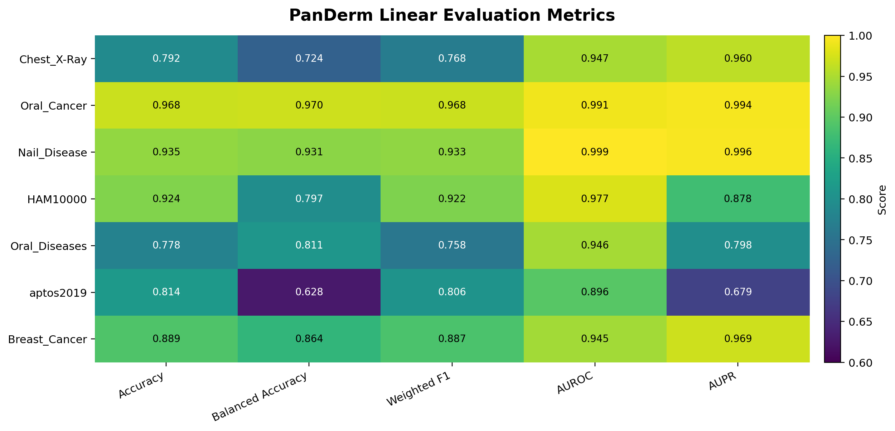
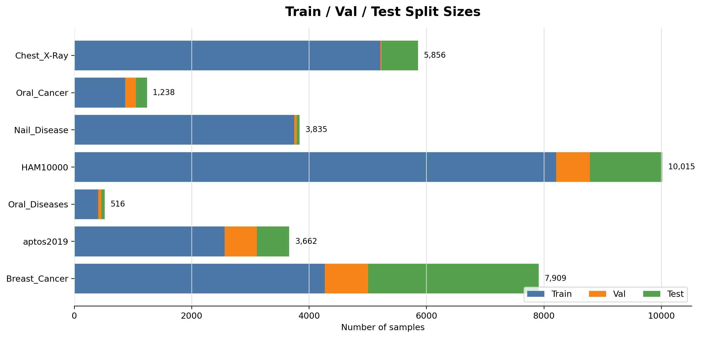
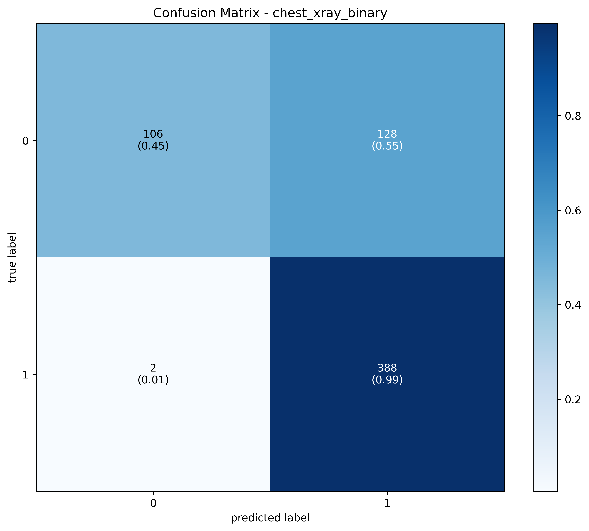
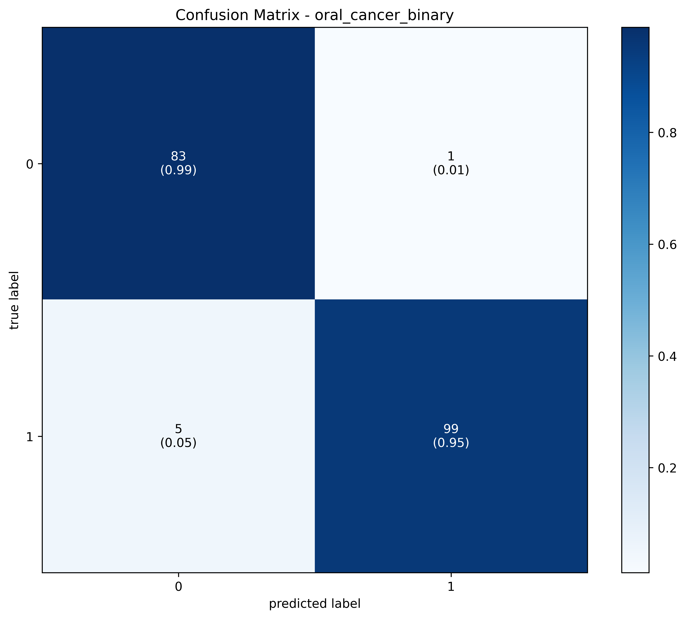
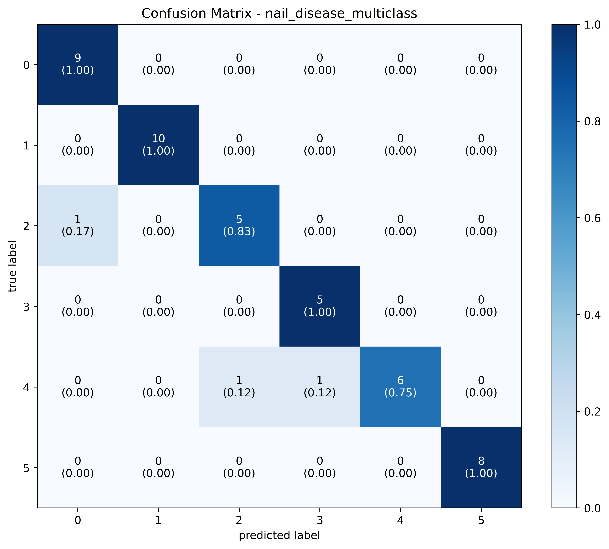
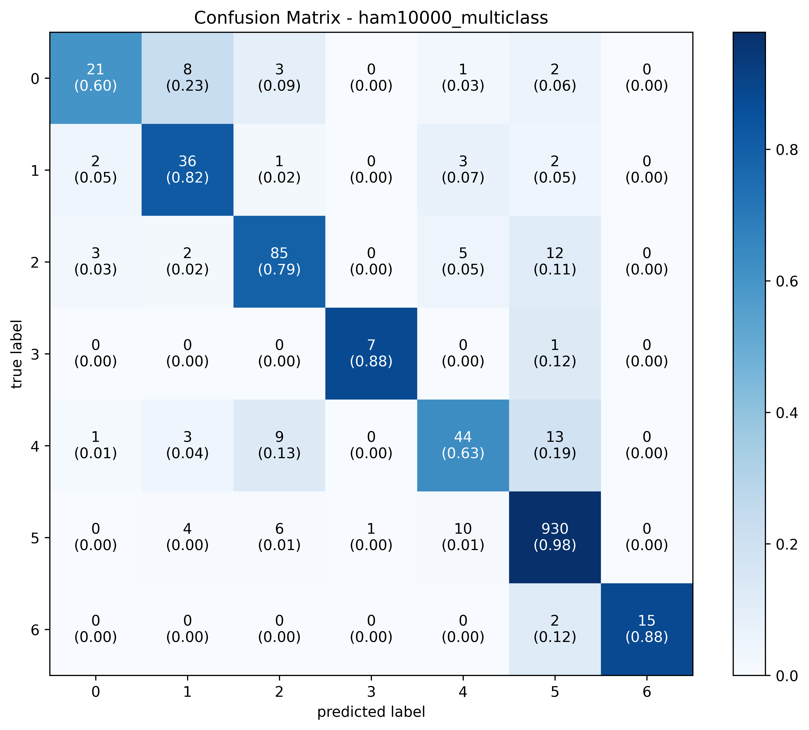
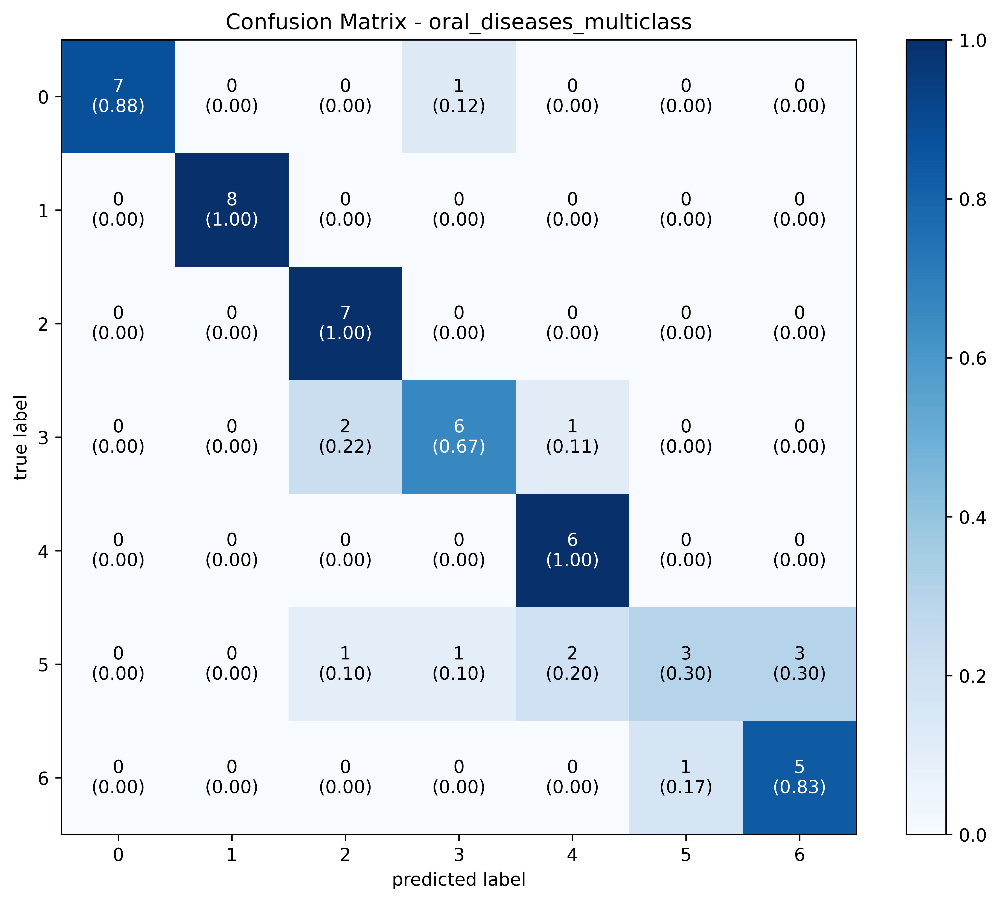
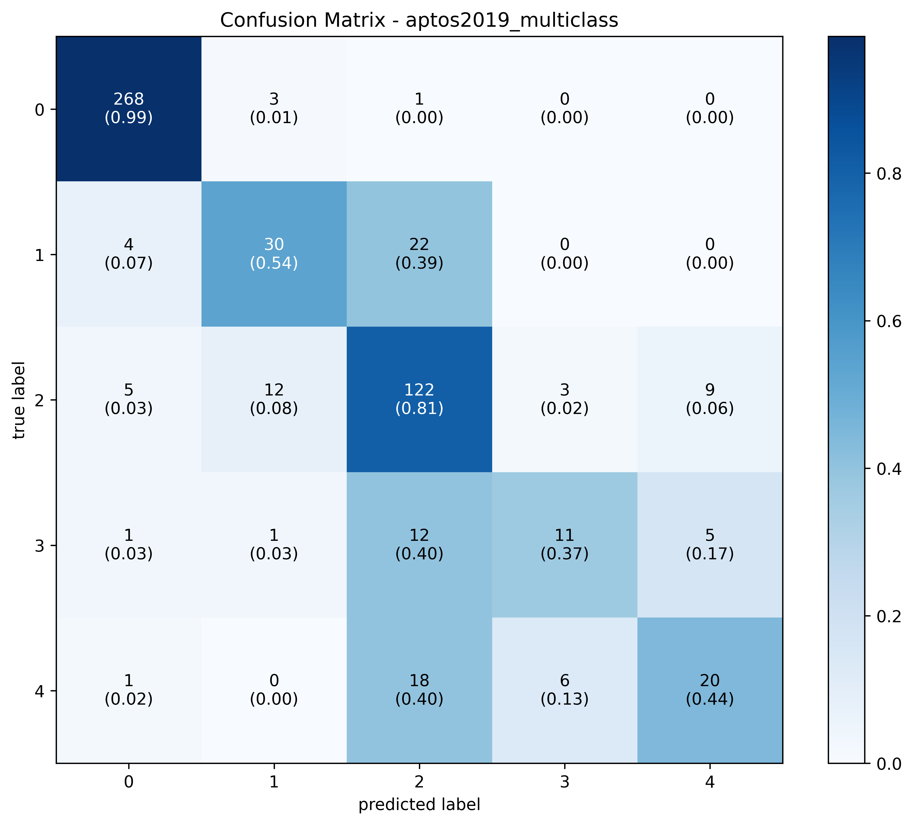
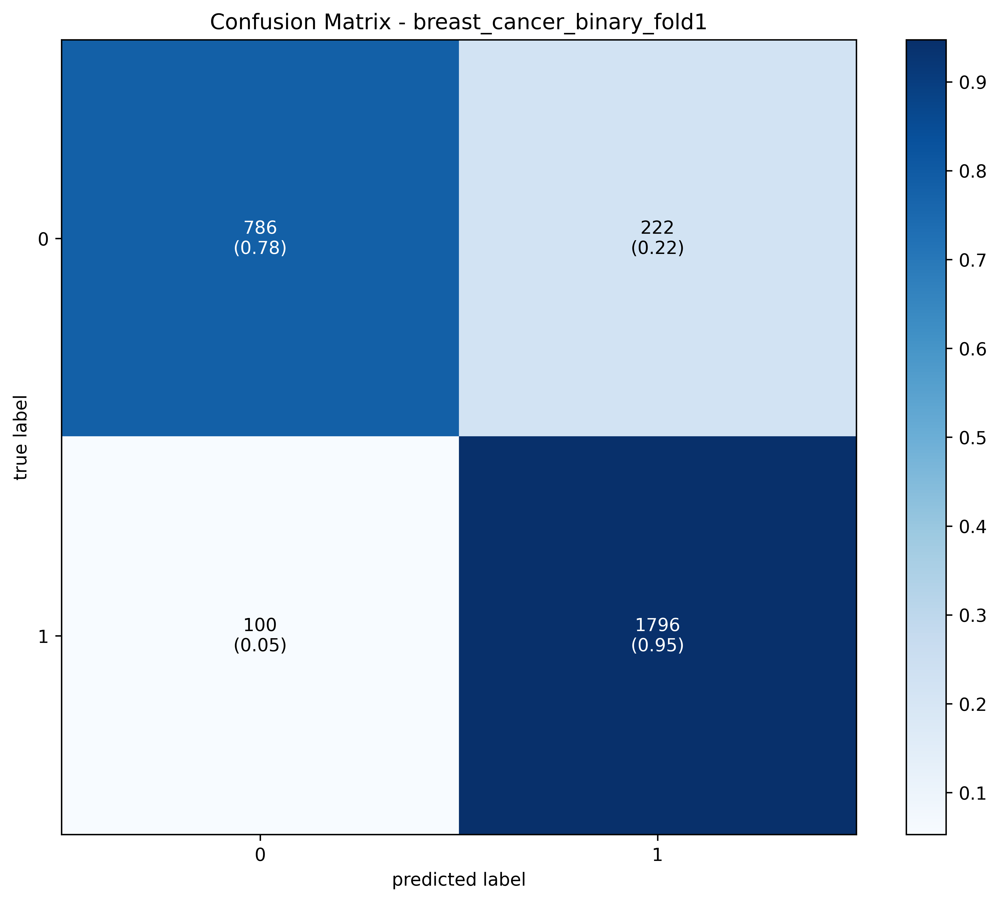

# PanDerm 선형 평가 결과 요약

생성일: 2026-06-13

PanDerm의 "Linear Evaluation on Image Classification Tasks" 실행 결과
`Metastatic_Tissue` 는 하드웨어 리소스 부족으로 시험 실패
모든 로그의 모델: `PanDerm_Large_LP`
모든 로그의 체크포인트: `../checkpoint/panderm_ll_data6_checkpoint-499.pth`

## 주요 성능 지표 비교

- ~~`Nail_Disease`와~~ `Oral_Cancer`는 전반적으로 높은 성능을 보임
- `Oral_Cancer` 는 높은 성능을 보인 반면에, `Oral_Diseases` 는 낮은 성능을 보임
  - `Oral_Cancer`: 이진 분류
  - `Oral_Diseases`: 다중 분류(7개 클래스)

## 데이터 split 크기 비교

- `Oral_Diseases`: test set이 작아 단일 점수 해석이 과대평가 될 수 있음

## 전체 결과

(AUPR 기준 정렬)
| 데이터셋 | 과제 | 클래스 수 | Train | Val | Test | 최적 cost | 정확도 | 균형 정확도 | 가중 F1 | AUROC | AUPR | Kappa |
|---|---:|---:|---:|---:|---:|---:|---:|---:|---:|---:|---:|---:|
| ~~Nail_Disease~~ | 다중 분류 | 6 | 3744 | 45 | 46 | 61.440 | 0.934783 | 0.930556 | 0.933237 | 0.999306 | 0.996032 | 0.969812 |
| Oral_Cancer | 이진 분류 | 2 | 866 | 184 | 188 | 20.480 | 0.968085 | 0.970009 | 0.968143 | 0.991300 | 0.994340 | 0.935734 |
| Breast_Cancer | 이진 분류 | 2 | 4269 | 736 | 2904 | 20.480 | 0.889118 | 0.863510 | 0.887275 | 0.944961 | 0.969478 | 0.748226 |
| Chest_X-Ray | 이진 분류 | 2 | 5216 | 16 | 624 | 20.480 | 0.791667 | 0.723932 | 0.767776 | 0.946932 | 0.960115 | 0.501916 |
| HAM10000 (피부암평가 사용) | 다중 분류 | 7 | 8208 | 575 | 1232 | 71.680 | 0.923701 | 0.796631 | 0.922471 | 0.977198 | 0.877647 | 0.880742 |
| Oral_Diseases | 다중 분류 | 7 | 407 | 55 | 54 | 71.680 | 0.777778 | 0.810714 | 0.758440 | 0.946320 | 0.798074 | 0.924818 |
| aptos2019 | 다중 분류 | 5 | 2562 | 546 | 554 | 51.200 | 0.814079 | 0.628013 | 0.806028 | 0.895654 | 0.679141 | 0.871755 |

평가기준

- 최적 cost: 작을 수록 좋음. 오진 시 발생하는 치명적 리스크(비용) 최소화
- 정확도: 전반적인 예측 성공률 확인 
- 균형 정확도: 양성과 음성 각각의 적중률을 공평하게 반영
- 가중 F1: 정밀도와 재현율을 종합하되 클래스 규모 반영
- AUROC: 환자와 정상을 서로 갈라놓는 전반적인 구별력 측정
- **AUPR(Area Under the Precision-Recall Curve): 진짜 환자(양성)를 얼마나 정확하게 잡아내는지 집중 평가**
- Kappa: 우연히 맞춘 확률을 제외한 정답과의 엄격한 일치도 확인

## 도메인 적합성 분석

PanDerm은 **피부 병변/피부유사 표면 병변 이미지에 가장 적합**하고, **구강 점막처럼 피부와 가까운 표면 질환**에서 강한 후보로 보임. 
반면에 다중 구강질환 감별에는 비록 TestSet 이 적었지만, 성능이 낮았기에 연구 가능성이 높아보임.

| 데이터셋 | 성능 | Train | Val | Test |
|---|---|---|---|---|
|  구강암/구강 병변 이진 분류 (`Oral_Cancer`) | AUROC 0.991, Balanced Accuracy 0.970, AUPR 0.994 | 866 | 184 |  188 | 
|  다중 구강질환 감별 (`Oral_Diseases`) | AUROC 0.946, Balanced Accuracy 0.811, Weighted F1 0.758 | 407 | 55 | 54 | 

지표별 순위

## 지표별 순위

### AUROC 기준

| 순위 | 데이터셋 | AUROC |
|---:|---|---:|
| 1 | Nail_Disease | 0.999306 |
| 2 | Oral_Cancer | 0.991300 |
| 3 | HAM10000 | 0.977198 |
| 4 | Chest_X-Ray | 0.946932 |
| 5 | Oral_Diseases | 0.946320 |
| 6 | Breast_Cancer | 0.944961 |
| 7 | aptos2019 | 0.895654 |

### 균형 정확도 기준

| 순위 | 데이터셋 | 균형 정확도 |
|---:|---|---:|
| 1 | Oral_Cancer | 0.970009 |
| 2 | Nail_Disease | 0.930556 |
| 3 | Breast_Cancer | 0.863510 |
| 4 | Oral_Diseases | 0.810714 |
| 5 | HAM10000 | 0.796631 |
| 6 | Chest_X-Ray | 0.723932 |
| 7 | aptos2019 | 0.628013 |

### 가중 F1 기준

| 순위 | 데이터셋 | 가중 F1 |
|---:|---|---:|
| 1 | Oral_Cancer | 0.968143 |
| 2 | Nail_Disease | 0.933237 |
| 3 | HAM10000 | 0.922471 |
| 4 | Breast_Cancer | 0.887275 |
| 5 | aptos2019 | 0.806028 |
| 6 | Chest_X-Ray | 0.767776 |
| 7 | Oral_Diseases | 0.758440 |

### AUPR 기준

| 순위 | 데이터셋 | AUPR |
|---:|---|---:|
| 1 | Nail_Disease | 0.996032 |
| 2 | Oral_Cancer | 0.994340 |
| 3 | Breast_Cancer | 0.969478 |
| 4 | Chest_X-Ray | 0.960115 |
| 5 | HAM10000 | 0.877647 |
| 6 | Oral_Diseases | 0.798074 |
| 7 | aptos2019 | 0.679141 |

## 데이터셋별 상세 결과

### Chest_X-Ray

원본: `PanDerm/data/Chest_X-Ray/Linear Evaluation/result.txt`

실행 입력:

- CSV: `../data/Chest_X-Ray/Linear Evaluation/chest_xray_binary.csv`
- 이미지 루트: `../data/Chest_X-Ray/chest_xray/`
- 예측 결과 출력: `../output_dir/chest_xray_panderm_large_lp/chest_xray_binary.csv`
- 지표 출력: `../output_dir/chest_xray_panderm_large_lp/chest_xray_panderm_large_lp_result.csv`

클래스별 분류 리포트:

| 클래스 | 정밀도 | 재현율 | F1 | 샘플 수 |
|---:|---:|---:|---:|---:|
| 0 | 0.98 | 0.45 | 0.62 | 234 |
| 1 | 0.75 | 0.99 | 0.86 | 390 |
| 매크로 평균 | 0.87 | 0.72 | 0.74 | 624 |
| 가중 평균 | 0.84 | 0.79 | 0.77 | 624 |

### Oral_Cancer

원본: `PanDerm/data/Oral_Cancer/Linear Evaluation/result.txt`

실행 입력:

- CSV: `../data/Oral_Cancer/Linear Evaluation/oral_cancer_binary.csv`
- 이미지 루트: `../data/Oral_Cancer/dataset/`
- 예측 결과 출력: `../output_dir/oral_cancer_panderm_large_lp/oral_cancer_binary.csv`
- 지표 출력: `../output_dir/oral_cancer_panderm_large_lp/oral_cancer_panderm_large_lp_result.csv`

클래스별 분류 리포트:

| 클래스 | 정밀도 | 재현율 | F1 | 샘플 수 |
|---:|---:|---:|---:|---:|
| 0 | 0.94 | 0.99 | 0.97 | 84 |
| 1 | 0.99 | 0.95 | 0.97 | 104 |
| 매크로 평균 | 0.97 | 0.97 | 0.97 | 188 |
| 가중 평균 | 0.97 | 0.97 | 0.97 | 188 |

### Nail_Disease

원본: `PanDerm/data/Nail_Disease/Linear Evaluation/result.txt`

실행 입력:

- CSV: `../data/Nail_Disease/Linear Evaluation/nail_disease_multiclass.csv`
- 이미지 루트: `../data/Nail_Disease/`
- 예측 결과 출력: `../output_dir/nail_disease_panderm_large_lp/nail_disease_multiclass.csv`
- 지표 출력: `../output_dir/nail_disease_panderm_large_lp/nail_disease_panderm_large_lp_result.csv`

클래스별 분류 리포트:

| 클래스 | 정밀도 | 재현율 | F1 | 샘플 수 |
|---:|---:|---:|---:|---:|
| 0 | 0.90 | 1.00 | 0.95 | 9 |
| 1 | 1.00 | 1.00 | 1.00 | 10 |
| 2 | 0.83 | 0.83 | 0.83 | 6 |
| 3 | 0.83 | 1.00 | 0.91 | 5 |
| 4 | 1.00 | 0.75 | 0.86 | 8 |
| 5 | 1.00 | 1.00 | 1.00 | 8 |
| 매크로 평균 | 0.93 | 0.93 | 0.92 | 46 |
| 가중 평균 | 0.94 | 0.93 | 0.93 | 46 |

### HAM10000

원본: `PanDerm/data/PanDerm_data/HAM10000/Linear Evaluation/result.txt`

실행 입력:

- CSV: `../data/PanDerm_data/HAM10000/Linear Evaluation/ham10000_multiclass.csv`
- 이미지 루트: `../data/PanDerm_data/HAM10000/HAM10000_clean/ISIC2018/`
- 예측 결과 출력: `../output_dir/ham10000_panderm_large_lp/ham10000_multiclass.csv`
- 지표 출력: `../output_dir/ham10000_panderm_large_lp/ham10000_panderm_large_lp_result.csv`

클래스별 분류 리포트:

| 클래스 | 정밀도 | 재현율 | F1 | 샘플 수 |
|---:|---:|---:|---:|---:|
| 0 | 0.78 | 0.60 | 0.68 | 35 |
| 1 | 0.68 | 0.82 | 0.74 | 44 |
| 2 | 0.82 | 0.79 | 0.81 | 107 |
| 3 | 0.88 | 0.88 | 0.88 | 8 |
| 4 | 0.70 | 0.63 | 0.66 | 70 |
| 5 | 0.97 | 0.98 | 0.97 | 951 |
| 6 | 1.00 | 0.88 | 0.94 | 17 |
| 매크로 평균 | 0.83 | 0.80 | 0.81 | 1232 |
| 가중 평균 | 0.92 | 0.92 | 0.92 | 1232 |

### Oral_Diseases

원본: `PanDerm/data/Oral_Diseases/Linear Evaluation/result.txt`

실행 입력:

- CSV: `../data/Oral_Diseases/Linear Evaluation/oral_diseases_multiclass.csv`
- 이미지 루트: `../data/Oral_Diseases/`
- 예측 결과 출력: `../output_dir/oral_diseases_panderm_large_lp/oral_diseases_multiclass.csv`
- 지표 출력: `../output_dir/oral_diseases_panderm_large_lp/oral_diseases_panderm_large_lp_result.csv`

클래스별 분류 리포트:

| 클래스 | 정밀도 | 재현율 | F1 | 샘플 수 |
|---:|---:|---:|---:|---:|
| 0 | 1.00 | 0.88 | 0.93 | 8 |
| 1 | 1.00 | 1.00 | 1.00 | 8 |
| 2 | 0.70 | 1.00 | 0.82 | 7 |
| 3 | 0.75 | 0.67 | 0.71 | 9 |
| 4 | 0.67 | 1.00 | 0.80 | 6 |
| 5 | 0.75 | 0.30 | 0.43 | 10 |
| 6 | 0.62 | 0.83 | 0.71 | 6 |
| 매크로 평균 | 0.78 | 0.81 | 0.77 | 54 |
| 가중 평균 | 0.79 | 0.78 | 0.76 | 54 |

### aptos2019

원본: `PanDerm/data/aptos2019/Linear Evaluation/result.txt`

실행 입력:

- CSV: `../data/aptos2019/Linear Evaluation/aptos2019_multiclass.csv`
- 이미지 루트: `../data/aptos2019/`
- 예측 결과 출력: `../output_dir/aptos2019_panderm_large_lp/aptos2019_multiclass.csv`
- 지표 출력: `../output_dir/aptos2019_panderm_large_lp/aptos2019_panderm_large_lp_result.csv`

클래스별 분류 리포트:

| 클래스 | 정밀도 | 재현율 | F1 | 샘플 수 |
|---:|---:|---:|---:|---:|
| 0 | 0.96 | 0.99 | 0.97 | 272 |
| 1 | 0.65 | 0.54 | 0.59 | 56 |
| 2 | 0.70 | 0.81 | 0.75 | 151 |
| 3 | 0.55 | 0.37 | 0.44 | 30 |
| 4 | 0.59 | 0.44 | 0.51 | 45 |
| 매크로 평균 | 0.69 | 0.63 | 0.65 | 554 |
| 가중 평균 | 0.81 | 0.81 | 0.81 | 554 |

### Breast_Cancer

원본: `PanDerm/data/Breast_Cancer/Linear Evaluation/result.txt`

실행 입력:

- CSV: `../data/Breast_Cancer/Linear Evaluation/breast_cancer_binary_fold1.csv`
- 이미지 루트: `../data/Breast_Cancer/BreaKHis_v1/`
- 예측 결과 출력: `../output_dir/breast_cancer_panderm_large_lp/breast_cancer_binary_fold1.csv`
- 지표 출력: `../output_dir/breast_cancer_panderm_large_lp/breast_cancer_panderm_large_lp_result.csv`

클래스별 분류 리포트:

| 클래스 | 정밀도 | 재현율 | F1 | 샘플 수 |
|---:|---:|---:|---:|---:|
| 0 | 0.89 | 0.78 | 0.83 | 1008 |
| 1 | 0.89 | 0.95 | 0.92 | 1896 |
| 매크로 평균 | 0.89 | 0.86 | 0.87 | 2904 |
| 가중 평균 | 0.89 | 0.89 | 0.89 | 2904 |

## Confusion Matrix 모음

아래 이미지는 기존 `PanDerm/output_dir/**/confusion_matrix_*.png` 파일을
`PanDerm/Linear Evaluation/figures/confusion_matrices/` 아래로 복사해 문서와
함께 볼 수 있도록 정리한 것입니다.

| 데이터셋 | Confusion Matrix |
|---|---|
| Chest_X-Ray |  |
| Oral_Cancer |  |
| Nail_Disease |  |
| HAM10000 |  |
| Oral_Diseases |  |
| aptos2019 |  |
| Breast_Cancer |  |

## 원본 파일 목록

| 데이터셋 | 원본 파일 |
|---|---|
| Chest_X-Ray | `PanDerm/data/Chest_X-Ray/Linear Evaluation/result.txt` |
| Oral_Cancer | `PanDerm/data/Oral_Cancer/Linear Evaluation/result.txt` |
| Nail_Disease | `PanDerm/data/Nail_Disease/Linear Evaluation/result.txt` |
| HAM10000 | `PanDerm/data/PanDerm_data/HAM10000/Linear Evaluation/result.txt` |
| Oral_Diseases | `PanDerm/data/Oral_Diseases/Linear Evaluation/result.txt` |
| aptos2019 | `PanDerm/data/aptos2019/Linear Evaluation/result.txt` |
| Breast_Cancer | `PanDerm/data/Breast_Cancer/Linear Evaluation/result.txt` |

